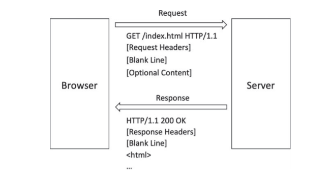
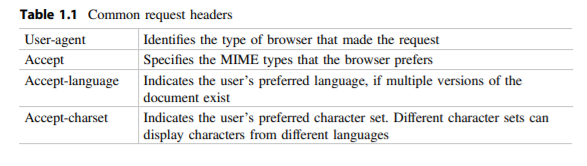
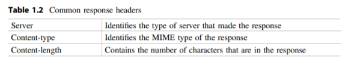

# Rails session 2 - Routes.

In session 1 we worked on a Rails website that gave us a glimpse as to the underlying mechanisms of the Rails Framework.

In this session we will study ' Routes ' and ' Routing ' in more depth and in context with Rails conventions. It is important to learn about Routing before moving forward with any other Rails concept since routing happens to be the first process that takes place when a user is trying to access your website through a web request (HTTP request).

We will be practicing and iterating on top of the last session's application to better enforce the concepts being introduced in this session.  But before moving any further let's take a deep dive into HTTP requests.

## What are HTTP requests ?

HTTP stands for 'Hyper Text Transfer Protocol' and was initiated by sir Timothy John Berners-Lee who is also the founder of the world wide web.

So basically when your browser and ultimately your computer encode's the data/request you wish to send out to the web as a digital entity - HTTP is the standard followed worldwide in every computer.

Like most western countries mostly use ' English ' to communicate. All computers on the internet use 'HTTP' as the standard means of communication.
 

Whenever someone accesses a web site on the Internet, two computers communicate. One computer has a software program known as a browser, the other computer has a software program known as a web server. 
The browser sends a request to the server  and the server sends a response to the browser. 
The request contains the URI ( or ' site path ' ) that is being requested  and information about the browser that is making the request.
The response contains the data that was requested (if it is available), information about the page, and information about the server. (visit this [link](https://www.aisangam.com/blog/http-request-message-format-well-explained/) for an extended look at HTTP requests and methods)

Both HTTP requests and responses have identical data structures albeit with different types of information.

**The request format** 
a. The first line contains the type of request, the name of the requested page and the protocol that is being used.  
b. Subsequent lines are the request headers. They contain information about the browser and the request. 
c. A blank line in the request indicates the end of the request headers 
d. In a POST request, additional information can be included after the blank line

**The response format** 
a. The first line contains the protocol being used, the status code and a brief description of the status. 
b. Subsequent lines are the response headers. They contain information about the server and the response.  
c. A blank line in the response indicates the end of the response headers. 
d. In a successful response, the content of the page will be sent after the blank line. 

Let's take an extended look at what the HTTP [Request Headers] contain, 

The content type header (in http response headers) is what tells your browser the type of content that is being carried in the response. These content types are expressed as Multipurpose Internet Mail Extensions [MIME] types

The basic structure of a MIME type is a general type, the general type for text has several specific types, for plain text, HTML text and style sheet text. These types are represented as text/plain, text/html and text/css, respectively

The most common content type on the web is HTML text, represented as the
MIME type text/html.  These MIME Types are important moving forward with ' Controllers ' and ' Views '.

## What are Routes ?

Routing is the process of handling a user request or more specifically defining how your web application's router handles a ' HTTP ' request. A Route is one such definition and a collection of ' Routes ' will define how your web application responds to user requests.

Routes are defined using a HTTP verb (http methods ; get , post , update...etc.) and a path pattern. (/mypath/subpath/...)

## How do we define a Route ?

